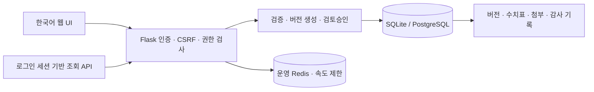

# RatingLog · 위험률 관리

Flask 기반의 보험 사망률·질병률 및 관련 위험률 자료 관리 앱입니다. 문서와 수치표를 한 원장에서 관리하고, 출처·인가정보·적용기간·변경 사유와 승인 이력을 남깁니다.

## 설계와 구현 범위

- 조직 내부 계정: 관리자, 작성자, 검토자, 열람자. 공개 회원가입 없이 관리자가 계정을 발급합니다.
- 위험률 원장: 코드, 제목, 종류, 범주, 인가정보, 출처, 정의, SQL 참고문구, 적용기간, 우선순위.
- 변경마다 새 버전 생성. 과거 내용·자료 보존, 낙관적 잠금으로 동시 편집 충돌 감지.
- 초안 → 검토 요청 → 승인/반려. 본인 자료는 본인이 승인할 수 없습니다.
- 문서형 또는 표형 자료. 연령·성별·흡연·경과기간별 CSV 검증, 확률/퍼센트/천분율을 구분하고 정규화.
- 검색·필터·페이지 이동·대시보드, 버전별 비교, 수치표 미리보기·차트, CSV/JSON 내보내기, 적용일 기준 승인표 조회 API.
- 첨부파일 크기·내용 검사 및 SHA-256 기록. 파일 바이트와 메타데이터를 DB 트랜잭션으로 함께 저장.
- 삭제 대신 보관, 관리자 복원, 감사 기록, 계정 비활성화 및 세션 무효화.
- Python 3, 최신 안정 의존성 고정, DB 마이그레이션, 보안 헤더·CSRF·속도 제한, 테스트/CI.
- 기존 SQLite 원장을 읽는 이관 CLI. 예전 비밀번호와 노출된 Twitter 키는 재사용하지 않습니다.

위 항목은 현재 구현된 기능입니다. 보험료 산출/최적화, 통계적 위험률 추정, 규제 적합성 자동 인증은 제공하지 않습니다.

## 실행

Python 3.13 이상을 사용합니다.

```bash
git clone https://github.com/kimdongup/ratinglog.git
cd ratinglog
python3 -m venv .venv
source .venv/bin/activate
python -m pip install -r requirements.txt
cp .env.example .env
# .env의 SECRET_KEY를 python -c "import secrets; print(secrets.token_hex(32))" 결과로 설정
flask --app ratinglog db upgrade
flask --app ratinglog create-user --email admin@example.com --name 관리자 --role admin
flask --app ratinglog run --host 127.0.0.1
```

<http://127.0.0.1:5000>에서 로그인합니다. CLI 비밀번호는 프롬프트로 입력하며 기본 비밀번호는 없습니다.

- [사용 설명서](usage.md)
- [배포·백업·이관](deploy.md)
- [설계와 개발 규칙](agents.md)
- [기존 Python 2 앱 리뷰 보관본](archive.md)

## 참고한 구현과 제품

2026-09-08 공식 자료를 조사했습니다. 공개된 기능과 데이터 모델 패턴을 참고하여 독자 구현하며 상용 소스·테이블 데이터를 복제하지 않습니다.

| 출처 | 도입한 패턴 | 범위 |
| --- | --- | --- |
| [SOA MORT](https://mort.soa.org/About.aspx) / [MortalityTables.jl](https://github.com/JuliaActuary/MortalityTables.jl) | 출처를 가진 위험률 표와 연령·선택기간 차원 | CSV 정규 형식; SOA XML 전체 호환이나 실데이터 재배포는 제외 |
| [Akur8 Data](https://www.akur8.com/pricing/data) | 입력 품질 검사와 데이터 변경 이력 | 중복·범위·결측 검사, 버전별 비교 |
| [WTW Radar](https://www.wtwco.com/en-gb/solutions/products/radar-for-commercial-lines-insurers) | 검증 후 배포 및 의사결정 감사 기록 | 검토승인과 승인표 API |
| [Milliman model governance](https://www.milliman.com/en/insight/Actuarial-model-governance-Empowering-people-with-technology) | 작성·검토·승인 역할 분리 | 승인자 분리, 변경 사유와 활동 이력 |

## 개발 검증

```bash
python -m pip install -r requirements-dev.txt
pytest
ruff check .
ruff format --check .
pip-audit -r requirements.txt
```

의존성 버전은 PyPI의 안정 릴리스를 확인해 고정합니다. 수치 예제는 합성 데이터이며 실제 보험계약에 사용할 위험률이 아닙니다.

## 구조와 데이터 흐름



`models.py`는 저장 모델, `services.py`는 업무 규칙과 접근 범위, `validation.py`는 CSV/첨부 검증, `views.py`는 원장·API, `auth.py`는 계정, `cli.py`는 발급·이관을 담당합니다. 자동 테이블 생성 대신 `migrations/`를 적용합니다. 외부 CDN과 프런트엔드 빌드 도구에 의존하지 않습니다.

## 검증 결과 (2026-09-08)

- Python 3.14에서 SQLite / PostgreSQL 회귀 테스트, 마이그레이션 왕복 및 데이터 이관 검증.
- 운영 모드의 PostgreSQL·Redis 연결, HTTPS 세션 쿠키, HSTS, 신뢰 호스트, 로그인 속도 제한, Redis 준비 상태 실패 처리 검증.
- Chromium에서 등록·CSV/PDF 첨부·파일 유지 수정·독립 승인·차트·다운로드·390px 모바일 화면 검증. JavaScript 콘솔 오류 없음.
- Ruff 및 의존성 호환성 검사 통과. `pip-audit`에서 알려진 취약점 미발견.
- GitHub Actions는 Python 3.13/3.14, SQLite/PostgreSQL, 운영 설정 및 브라우저 검증을 자동 실행하도록 구성했습니다.

실제 운영 도메인 배포, 실사용 자료 이관과 재해 복구 훈련은 별도 환경에서 수행해야 합니다. 기관별 인증·규제 요구 충족이나 악성코드 무결성을 보장하는 제품 인증을 의미하지 않습니다.

브라우저 검증 재실행:

```bash
python -m playwright install chromium
PYTHONPATH=. python scripts/browser_smoke.py
```

스크린샷은 Git에서 제외된 `artifacts/`에 생성됩니다. 직접 및 전이 의존성은 `constraints.txt`에 고정되어 있습니다. 업데이트 시 버전을 다시 확인하고 테스트와 취약점 검사를 함께 실행하세요.
