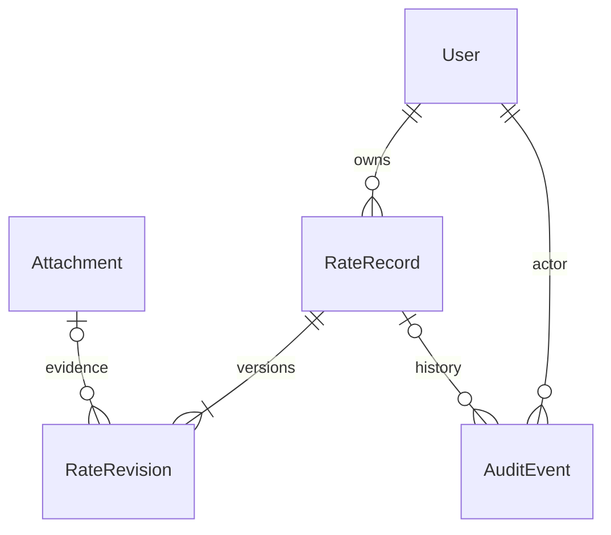

# RatingLog 설계 및 개발 규칙

## 목적

Flask를 유지하며 보험 위험률과 근거 자료의 정확성·추적성·접근 통제를 우선합니다. 일반 사진 공유나 SNS 앱으로 확장하지 않습니다. `archive.md`는 이전 리뷰의 역사적 기록입니다.

## 구조와 불변식

- 앱 팩토리 + Blueprint, SQLAlchemy 2 모델, Flask-Migrate/Alembic 마이그레이션.
- 하나의 설치는 하나의 조직. editor의 비승인 자료는 소유자와 관리자만 접근하고 reviewer는 제출 자료와 본인이 검토한 버전에도 접근합니다. 승인된 버전은 조직 계정에 공개합니다.
- `RateRecord`는 고유 코드·소유자·보관 여부·잠금 번호를 보관합니다. `RateRevision`은 업무 메타데이터·수치표·첨부 참조의 불변 스냅샷입니다. 내용 수정은 새 버전 생성만 허용합니다.
- 상태: draft → submitted → approved 또는 rejected. rejected/approved 수정은 새 draft를 만듭니다. submitted 상태 편집 금지. 본인 소유/작성 자료 자기 승인 금지.
- 모든 변경·상태 전이는 잠금 번호를 검사하고 기록과 감사 이벤트를 한 트랜잭션으로 커밋합니다. stale 요청은 409로 거절합니다.
- 첨부 바이트를 DB BLOB에 저장해 파일/DB 불일치 및 워커 간 공유 문제를 없앱니다. 파일명은 표시용이며 경로로 사용하지 않습니다. ZIP은 추출하지 않습니다.
- 수치는 Decimal 문자열로 보존합니다. JSON float로 위험률을 왕복하지 않습니다. 단위와 정규화 값은 구분합니다.
- CSV 내보내기에는 고정된 수치표 헤더만 사용합니다. 임의 메타데이터를 스프레드시트 수식으로 내보내지 않습니다.
- SQL 필드는 표시·보관만 하고 절대 실행하지 않습니다. 외부 URL을 서버에서 자동 가져오지 않습니다.
- 삭제는 보관 상태 전이. 계정은 비활성화, 감사 이벤트는 앱에서 수정/삭제 금지.

## 보안과 운영

CSRF를 전역 적용하고 상태 변경은 POST만 사용합니다. 기본 관리자/키를 하드코딩하지 않습니다. 운영에서는 긴 비밀키·PostgreSQL·Redis·신뢰 호스트를 요구합니다. 인증 쿠키에 비밀번호/ORM 객체를 넣지 않습니다. 비밀번호·권한 변경 시 세션 버전을 올립니다. 예외나 비밀 설정을 사용자에게 출력하지 않습니다. 보안 헤더, 서버측 입력·업로드 한도, 로그인 속도 제한을 유지합니다.

## 구현 순서

1. `archive.md` 보존 및 README/usage/deploy/agents 문서 작성.
2. 최신 안정 의존성, 모델·마이그레이션·인증·권한 구현.
3. 원장·버전·CSV·검토승인·감사·이관 구현.
4. 한국어 서버 렌더링 UI, 검색·대시보드·비교·차트·내보내기·API.
5. 회귀/보안/워크플로 테스트와 정적 검사, 실제 실행 확인, 문서를 결과와 동기화.

## 테스트 기준

권한 없는 ID 접근과 새 초안 유출, CSRF, 자기 승인, 부정 상태 전이, 동시 편집, 버전 불변성, 적용일, CSV 경계값·중복·NaN, ZIP 경로·압축폭탄, 트랜잭션 롤백, 레거시 이관, 마이그레이션을 검증합니다. 동작을 검증하는 테스트를 작성하며 테스트를 통과시키기 위해 검증을 끄지 않습니다. 로컬/운영 환경에서 실행하지 않은 검증은 완료로 표기하지 않습니다.

## 조사에 따른 범위 결정

README의 공식 출처에서 표 차원, 출처 관리, 데이터 검증, 버전 이력, 검토승인, 감사 기록을 채택했습니다. ML 보험료 최적화, 광범위한 계리 모델, SSO/MFA 및 기관별 전자결재는 별도 통합 과제로 남깁니다. 문서의 기능 목록과 실제 구현은 항상 일치시킵니다.

## 데이터 관계

웹 계정 발급은 일반 역할만 허용하며 관리자 발급은 CLI로 제한합니다. 브라우저·운영 검증 스크립트는 임시 DB/전용 PostgreSQL 스키마를 생성하고 정리합니다. `TEST_DATABASE_URL`에는 운영 DB를 지정하지 않습니다. CI 액션은 확인한 최신 안정 버전의 커밋 SHA로 고정합니다.
